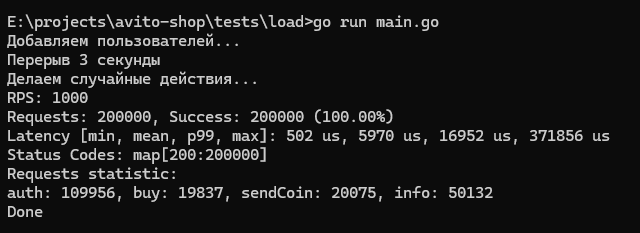

## Тестовое задание: внутренний магазин мерча

Запуск в контейнере:

```
docker compose up
```

Локальный запуск (потребуется поменять uri подключения к бд):

```
make run
```

Запуск всех тестов:

```
make test
```

Просмотр тестового покрытия:

```
make test-cov
```

Запуск только интеграционных тестов:

```
make test-integration
```

## Тестирование

Unit-тестами покрыты все бизнес сценарии.  
Общее покрытие проекта - 53.8%.  
Интеграционные тесты реализованы для всех хедлеров: auth, info, buy, sendCoin.

## Нагрузочное тестирование

Проведено нагрузочное тестирование 1000 RPS в течение 200 секунд.  
CPU: i5-13600k, RAM: 64 Gb DDR5  
Сценарий в `tests/load/main.go`.

### Результаты:

  
Доступность: 100%  
Среднее время ответа: 6 мс  
99% ответов: < 17 мс  
Максимальный ответ: 317 мс.

## Технологии:

-   Uber FX
-   HTTP Fiber
-   Postgres

## Вопросы:

1. Ничего не сказано про защиту от случайных двойных покупок и переводов. Добавил ключ идемпотентности.
2. Ничего не сказано про время жизни jwt токенов. Добавил контроль времени.
3. Не было требований по уровню защиты от двойной траты. Выбрал оптимальное решение в плане цена/качество:
    - Repeatable Read транзакции (полная защита от перезаписи)
    - Лог операций, благодаря которому после каждого изменения можно надежно пересчитать баланс
    - Запись пользователя в таблице с итоговым балансом также пересчитывается после изменения, но поскольку там на каждого пользователя уникальная строка, при попытке прочитать строчку, которая была модифицирована другой транзакцией, будет конфликт и откат второй транзакции, что, в свою очередь, исключает любой рассинхрон и двойные траты
4. Не понял формулировку "Сгруппированную информацию о перемещении монеток в его кошельке", при том что в DTO поле называется coinHistory. В итоге решил сделать вывод агрегированной суммы по каждому контрагенту. Если всё-таки нужна именно история — модифицировать можно буквально изменив одну строчку.
